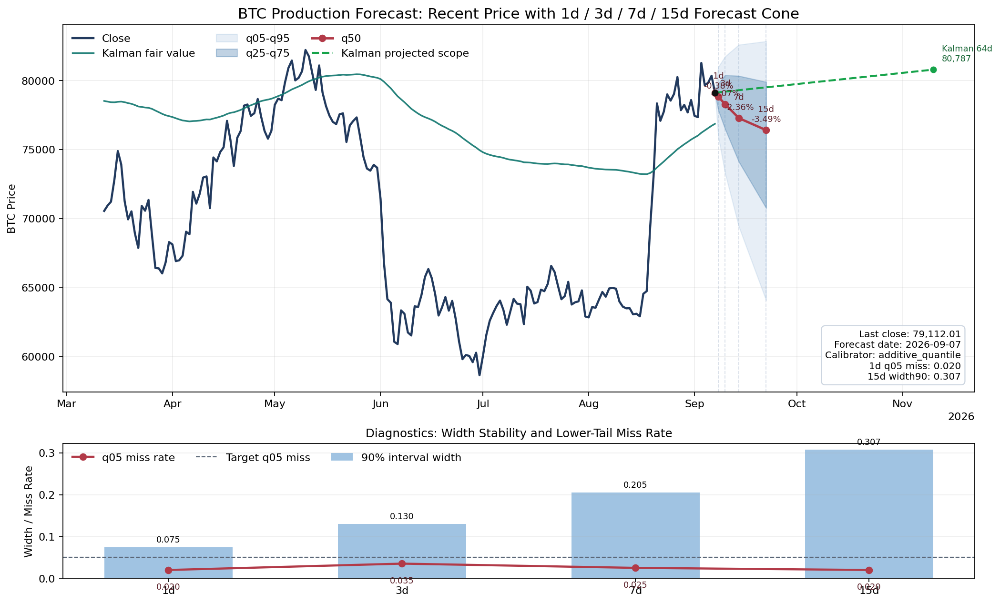
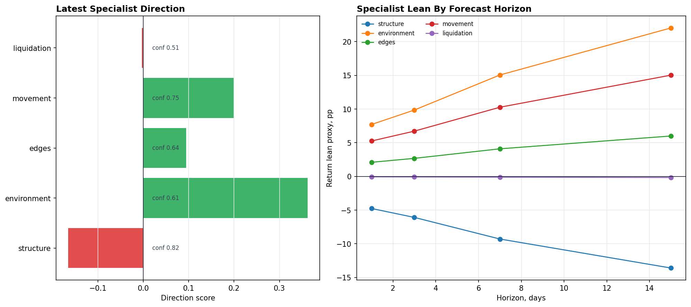
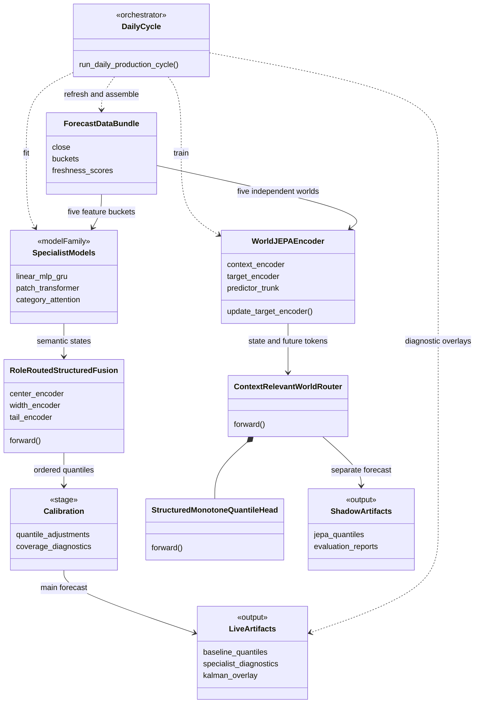
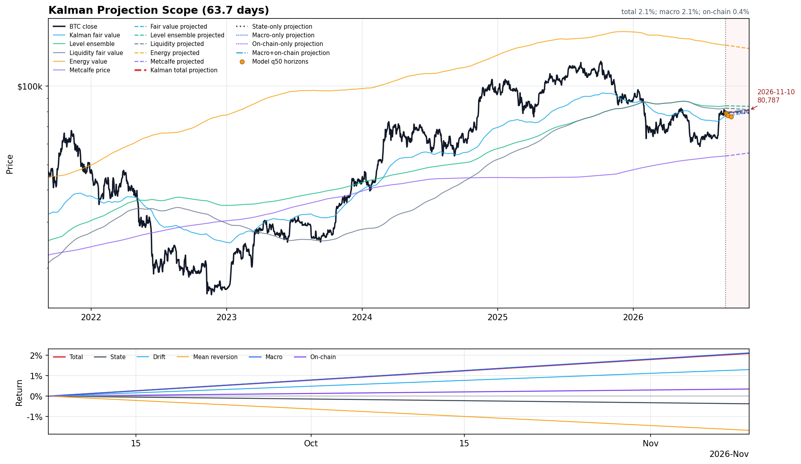

# VLA + JEPA Bitcoin Forecasting

**Five market perspectives. Four forecast horizons. An inspectable representation of Bitcoin.**

Bitcoin behaves differently over a day, a week and a fortnight. This Python/PyTorch system learns from price, macroeconomic, on-chain and liquidation data to represent those changing conditions and produce probabilistic forecasts at **1, 3, 7 and 15 days**. It exposes the specialist states, forecast uncertainty and valuation context behind its outputs.

The engineering contribution is a complete research workflow: data ingestion, feature construction, representation learning, forecast fusion, calibration, historical replay and visual reporting, coordinated through `main.py`.

The project explores a **two-stage design inspired by vision–language architectures (VLA)**: one stage builds representations, and a second stage interprets them. Here, that idea is applied to numerical market data. A separate **five-world JEPA pipeline** learns predictive representations and produces shadow forecasts.

- **BTC-specific context:** valuation, liquidity, price dynamics and leverage are represented as distinct information domains.
- **Horizon-aware reasoning:** learned horizon embeddings let the forecast change with the question being asked, from tomorrow's distribution to the next fortnight's.
- **Visible model behavior:** specialist diagnostics, world attention, quantile bands and Kalman overlays make the system practical to inspect and discuss.



*Saved output snapshot dated September 7, 2026. The main model forecasts 1, 3, 7 and 15 days ahead. The red line is the median; shaded regions span q25–q75 and q05–q95. The lower panel reports interval width and lower-tail misses. The green Kalman projection is a separate valuation overlay. These are captured research outputs, not a continuously updated feed or evidence of trading performance.*

## VLA-inspired approach: representation, then interpretation

The VLA inspiration is architectural: chain two modeling stages so the second can interpret the first stage's representations. The implementation uses numerical time series throughout, with forecasts and diagnostics as its outputs.

**Tier 1 — specialist representations.** Five specialist domains organize different kinds of market information:

| Specialist | Information it represents | Role in the final model |
| --- | --- | --- |
| **Structure** | Longer-term valuation, network and market structure | Tail behavior |
| **Environment** | Macro conditions, liquidity and risk regime | Distribution width and tails |
| **Edges** | Shorter-term opportunity and directional context | Center and width |
| **Movement** | Price dynamics, trend and technical state | Center and width |
| **Liquidation** | Leverage, positioning and liquidation pressure | Width and tails |

Each specialist combines models with different lookback windows. The retained models include linear models, MLPs, GRUs, PatchTST-like transformers and category attention. They learn explicit semantic targets and emit state features together with freshness, validity, disagreement and changes in state over time.

**Tier 2 — forecast interpretation.** `RoleRoutedStructuredFusion` combines these states through separate **center**, **width** and **tail** branches. Learned horizon embeddings adapt the output to each forecast horizon. Positive quantile gaps construct an ordered distribution, and a subsequent calibration step adjusts its coverage. The exported quantiles are **q05, q25, q50, q75 and q95**.

This separation makes the forecast inspectable: a specialist can support the directional center, widen the uncertainty interval, or affect the tails through its configured role.

See [specialists.py](dual_model_forecaster/specialists.py), [final_selection.py](dual_model_forecaster/final_selection.py) and [model_assembly/common.py](model_assembly/common.py). The retained models and routing are defined in [specialists.yaml](configs/final/specialists.yaml) and [roles.yaml](configs/final/roles.yaml).



*The left panel compares specialist direction and confidence. The right panel scales those signals across forecast horizons. These “lean” values are diagnostic proxies computed from direction, confidence and horizon scale; they are not independently calibrated return predictions.*

## JEPA: predicting future representations

**JEPA (Joint Embedding Predictive Architecture)** provides a second way to learn market state. Each of the same five domains has an independent `WorldJEPAEncoder`:

1. A **context encoder** reads a masked historical feature window using causal attention.
2. A **target encoder** represents a future feature block during training. Its parameters follow an exponential moving average of the context encoder, and gradients do not pass through the target branch.
3. A **horizon-conditioned predictor** learns to predict the future block's embedding from the available context. Variance and covariance regularization discourage collapsed representations.
4. A **world router** attends to the resulting state and predicted-future tokens, accounting for freshness, validity, missingness and uncertainty. A structured quantile head maps the combined representation to a return distribution.

The current configuration uses a 48-dimensional latent representation and top-2 world routing. All five worlds are encoded before routing. Continuous horizon embeddings support positive fractional-day queries, while training labels remain daily and calibration between trained horizons is interpolated.

The JEPA pipeline uses chronological, purged splits and separate validation, calibration and test periods. It includes feature-availability checks and comparisons with causal baselines. These controls are evaluation machinery; they do not establish that the model outperforms those baselines.

**JEPA runs in shadow mode by default.** Its forecasts go to `reports/world_jepa/live_shadow_forecast.csv`, with checkpoints under `artifacts/world_jepa/`. The main forecast and screenshots above come from the specialist-fusion path. The `main.py` JEPA bridge does not certify the full test suite or promote the shadow model.

See [world_encoder.py](dual_model_forecaster/world_jepa/world_encoder.py), [router.py](dual_model_forecaster/world_jepa/router.py), [pipeline.py](dual_model_forecaster/world_jepa/pipeline.py) and [world_jepa.json](configs/world_jepa.json).

## What the learned BTC representations show

The saved JEPA run uses **all five information domains**, with mean world-attention shares between **12.7% and 27.3%**. Its test-window regime diagnostics expose different rates of change: structure and environment have 1 and 2 dominant-state transitions, while edges and movement have 17 and 16. These are inspectable internal behaviors, influenced by the model's targets and smoothing; predictive usefulness is measured separately below.

**The most promising result is at the longer horizons:** in the saved shadow evaluation, the 15-day forecast achieved **7.52% lower reported WIS** than the strongest included causal baseline; the 7-day improvement was **1.08%**. Lower scores indicate better probabilistic forecasts under this evaluator. The full horizon breakdown keeps the shorter-horizon weaknesses visible:

| Horizon | Scored forecasts | JEPA WIS | Best included baseline WIS | JEPA relative score |
| --- | ---: | ---: | ---: | --- |
| 1 day | 364 | 0.015200 | 0.010870 | 39.84% worse |
| 3 days | 362 | 0.020530 | 0.019488 | 5.35% worse |
| 7 days | 358 | 0.030845 | 0.031181 | **1.08% better** |
| 15 days | 350 | 0.046159 | 0.049915 | **7.52% better** |

The best included comparator was causal EWMA at every horizon. These results come from one historical test window with overlapping targets. Equal-weight mean WIS across the four horizons is **1.15% worse overall**; the aggregate bootstrap confidence interval crosses zero, and the 15-day lower-tail miss rate exceeds the configured limit. The model remains in shadow mode. The result supports further investigation of week-to-fortnight representations; it does not establish a general forecasting advantage.

<details>
<summary>Evaluation provenance and the main-model comparison</summary>

The table is transcribed from local `reports/world_jepa/run_summary.json`, corroborated by `candidate_metrics.csv`, `causal_baseline_metrics.csv` and `promotion_gates.json`. Stored datasets and generated reports are intentionally excluded from Git; the aggregate results are recorded here.

- Run content hash: `0c69eb376f3849da04317df1cbafe2f6c81bcf424d397721fa13d3163342f41c`.
- Training observations: August 17, 2017–July 9, 2024.
- Test origins: September 8, 2025–September 7, 2026; each horizon is scored only where its outcome is available.
- Selection and test segments are separated by a 30-day purge; router validation and calibration use separate selection subsegments.
- Relative improvement is `100 * (baseline WIS - JEPA WIS) / baseline WIS`.
- The strongest included baseline is selected by the lowest reported test WIS among five causal comparators at each horizon.
- Aggregate bootstrap: 1,000 samples, 15-row blocks; reported interval for candidate-minus-baseline loss is `[-0.001292, +0.001695]`.

The **main specialist-fusion model** has a separate, longer historical replay. Its saved June evaluation in `reports/walk_forward/brutal_baseline_metrics.csv` trails EWMA at every selected horizon. It mixes 8,120 rows bearing the current candidate name with 24 rows from an older candidate; it is not an evaluation of the September refit:

| Horizon | Scored forecasts | Main-model WIS | EWMA WIS |
| --- | ---: | ---: | ---: |
| 1 day | 2,037 | 0.129725 | 0.063286 |
| 3 days | 2,035 | 0.225253 | 0.109892 |
| 7 days | 2,031 | 0.425146 | 0.175804 |
| 15 days | 2,015 | 0.347587 | 0.267626 |

These two evaluators use different WIS formulations and evaluation samples. Compare each model with its own matched baseline; their absolute WIS values should not be compared across tables. The main screenshots illustrate the specialist-fusion system, while the longer-horizon improvement above belongs to the JEPA shadow experiment.

</details>

## How it compares with other forecasting approaches

The project's distinctive contribution is **BTC-specific representation learning with inspectable modeling stages**, integrated into a working data-to-report pipeline.

| Approach | What it offers | This project's emphasis |
| --- | --- | --- |
| **GARCH / volatility baselines** | Established models of conditional variance with multi-step uncertainty forecasts. [arch documentation](https://bashtage.github.io/arch/univariate/forecasting.html) | Combines volatility with valuation, macro liquidity, directional state and liquidation pressure. These simple baselines remain serious competitors in the local evaluation. |
| **PatchTST** | Patch-based transformers with channel independence, supporting forecasting and self-supervised representation learning. [Original paper](https://arxiv.org/abs/2211.14730) | Uses PatchTST-like models within specialist ensembles, then adds explicit forecast roles, calibration and a separate JEPA future-embedding objective. |
| **Amazon Chronos-2** | Pretrained zero-shot forecasting for univariate, multivariate and covariate-informed tasks. [Amazon Science](https://www.amazon.science/blog/introducing-chronos-2-from-univariate-to-universal-forecasting) | Trains on deliberately organized BTC feature domains and exposes specialist states, forecast roles and horizon-dependent world attention. |
| **Google TimesFM-3** | A pretrained multivariate forecasting model supporting past and known-future covariates, point forecasts and quantiles. [Google Research](https://research.google/blog/timesfm-3-a-zero-shot-foundation-model-for-multivariate-forecasting/) | Focuses on domain-specific representation learning, semantic interpretation and research diagnostics for Bitcoin. |

The external-model comparison concerns architecture and scope. No matched benchmark against standalone PatchTST, Chronos-2 or TimesFM-3 has been established in this repository. The portfolio strength is the implemented system and its transparent evaluation, with a specific, measurable longer-horizon JEPA result to investigate further.

## UML architecture

This UML class diagram groups model families and output artifacts for readability. `DailyCycle`, `SpecialistModels`, `Calibration`, `LiveArtifacts` and `ShadowArtifacts` are conceptual groups; the named encoder, router, fusion and data-bundle classes exist in the Python implementation. It uses [GitHub's native Mermaid support](https://docs.github.com/en/get-started/writing-on-github/working-with-advanced-formatting/creating-diagrams).



## Kalman projection and valuation context



*The top panel compares BTC price with Kalman fair value, liquidity, energy-value and Metcalfe-style valuation anchors. The lower panel decomposes the projection into state, drift, mean-reversion, macro and on-chain components. The approximately 64-day scope belongs to this saved valuation diagnostic and is separate from the main model's 1–15-day forecasts.*

## Run locally

Use **Python 3.13** and **uv**. From the repository root:

```bash
uv sync --frozen
uv run python main.py --help
```

The help command inspects available options without refreshing data or fitting models. This is a source-and-visuals repository: databases, CSV datasets, extensionless data exports, credentials and trained checkpoints are intentionally excluded from Git. A full run needs locally provisioned historical inputs and access to the upstream sources.

Set the credentials needed for your data sources in your shell or a local `.env` file:

| Variable | Used by |
| --- | --- |
| `FRED_API_KEY` | FRED macroeconomic series |
| `BITLAB_API_TOKEN` | ResearchBitcoin on-chain endpoints |
| `COINALYZE_API_KEY` | Funding, positioning and liquidation refresh |

Missing FRED or Coinalyze credentials skip those updates; they do not replace the missing historical data. Local `.env` files are loaded automatically and remain ignored by Git.

Before a full run, provision your manual macro exports under `get_data/manual/` and historical liquidation inputs under `liquidations/data/`, including `directional_volatility_potential.csv`. Optional heatmap enrichment files live under `liquidations/Liquedation heatmap/data/` and `liquidations/Liquedation heatmap/outputs/`. Daily API refresh does not reconstruct all of this history; a fresh clone is ready for code inspection, but needs local data preparation before training.

Run the complete daily cycle:

```bash
uv run python main.py
```

This refreshes inputs, rebuilds feature buckets, updates historical walk-forward records, trains the five-world JEPA model, refits the specialist-fusion forecast, and writes live diagnostics. Historical backfilling and model training can take substantial time.

For a smaller first forecast run, skip historical backfill and JEPA training:

```bash
uv run python main.py --skip-walk-forward --skip-jepa-training --skip-meta-learner
```

This still refreshes data and fits the main model. With existing local databases and feature tables, add `--skip-data-refresh --skip-category-refresh` to reuse them. Local manual macro files are still imported; these options do not make the run read-only.

Other useful options include `--world-jepa-smoke` for a bounded JEPA wiring check, `--walk-forward-limit N` to limit historical replay, and `--legacy-jepa-training` for the older pooled JEPA compatibility path. A smoke run still requires the input data.

## Repository scope

| Path | Purpose |
| --- | --- |
| `main.py` | Daily orchestration and live visualizations |
| `get_data/`, `liquidations/` | Source ingestion code; historical inputs are provisioned locally |
| `compute_data/` | Technical, macro, on-chain and specialist feature construction |
| `dual_model_forecaster/` | Specialist models, fusion, calibration, baselines and JEPA |
| `model_assembly/common.py` | Assembly and full-history refitting |
| `walk_forward_predictions.py` | Historical replay and meta-synthesis called by `main.py` |
| `configs/final/`, `configs/world_jepa.json` | Main model and shadow model configuration |
| `artifacts/final/live_forecast/` | Three selected README images; other generated files stay local |

[.gitignore](.gitignore) is an explicit allowlist: runtime source code, configurations, installation metadata, this README and its three images. Credentials, databases, CSV/TSV datasets, extensionless data exports, checkpoints, other generated reports, old descriptive documents, tests, notebooks and unrelated entry points stay on disk but are omitted from Git. New runtime source dependencies must be added to the allowlist.

## Evaluation boundary

The project demonstrates data engineering, modular time-series modeling, representation learning, probabilistic calibration and interpretable reporting. The images illustrate model behavior, not validated profitability. Historical feature availability, upstream revisions and fitted preprocessing matter when interpreting a replay; reusing feature tables alone does not establish a leakage-free backtest. Shadow forecasts require independent evaluation before any claim of improvement.
