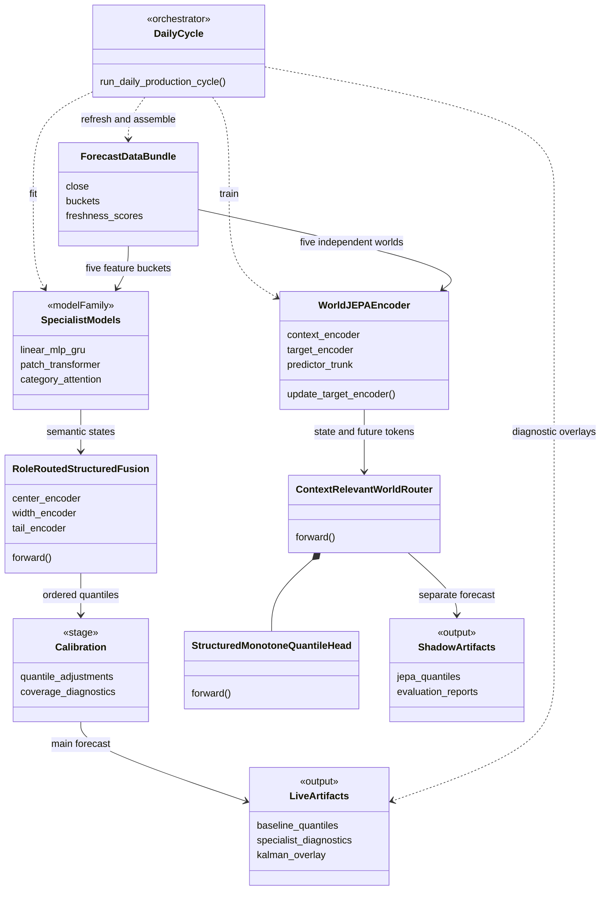

# VLA + JEPA Bitcoin Forecasting

A Python/PyTorch research system that turns price, macroeconomic, on-chain and liquidation data into interpretable market states and probabilistic Bitcoin forecasts. One entry point, `main.py`, coordinates data ingestion, feature engineering, model fitting, historical replay and visual reporting.

The project explores a **two-stage design inspired by vision–language architectures (VLA)**: one stage builds representations, and a second stage interprets them. Here, that idea is applied to numerical market data. A separate **five-world JEPA pipeline** learns predictive representations and produces shadow forecasts.


*Saved output snapshot dated September 7, 2026. The main model forecasts 1, 3, 7 and 15 days ahead. The red line is the median; shaded regions span q25–q75 and q05–q95. The lower panel reports interval width and lower-tail misses. The green Kalman projection is a separate valuation overlay. These are captured research outputs, not a continuously updated feed or evidence of trading performance.*

## VLA-inspired approach: representation, then interpretation

The VLA inspiration is architectural: chain two modeling stages so the second can interpret the first stage's representations. The implementation uses numerical time series throughout, with forecasts and diagnostics as its outputs.

**Tier 1 — specialist representations.** Five specialist domains organize different kinds of market information:

| Specialist | Information it represents | Role in the final model |
| --- | --- | --- |
| **Structure** | Longer-term valuation, network and market structure | Tail behavior |
| **Environment** | Macro conditions, liquidity and risk regime | Distribution width and tails |
| **Edges** | Shorter-term opportunity and directional context | Center and width |
| **Movement** | Price dynamics, trend and technical state | Center and width |
| **Liquidation** | Leverage, positioning and liquidation pressure | Width and tails |

Each specialist combines models with different lookback windows. The retained models include linear models, MLPs, GRUs, PatchTST-like transformers and category attention. They learn explicit semantic targets and emit state features together with freshness, validity, disagreement and changes in state over time.

**Tier 2 — forecast interpretation.** `RoleRoutedStructuredFusion` combines these states through separate **center**, **width** and **tail** branches. Learned horizon embeddings adapt the output to each forecast horizon. Positive quantile gaps construct an ordered distribution, and a subsequent calibration step adjusts its coverage. The exported quantiles are **q05, q25, q50, q75 and q95**.

This separation makes the forecast inspectable: a specialist can support the directional center, widen the uncertainty interval, or affect the tails through its configured role.

See [specialists.py](dual_model_forecaster/specialists.py), [final_selection.py](dual_model_forecaster/final_selection.py) and [model_assembly/common.py](model_assembly/common.py). The retained models and routing are defined in [specialists.yaml](configs/final/specialists.yaml) and [roles.yaml](configs/final/roles.yaml).


*The left panel compares specialist direction and confidence. The right panel scales those signals across forecast horizons. These “lean” values are diagnostic proxies computed from direction, confidence and horizon scale; they are not independently calibrated return predictions.*

## JEPA: predicting future representations

**JEPA (Joint Embedding Predictive Architecture)** provides a second way to learn market state. Each of the same five domains has an independent `WorldJEPAEncoder`:

1. A **context encoder** reads a masked historical feature window using causal attention.
2. A **target encoder** represents a future feature block during training. Its parameters follow an exponential moving average of the context encoder, and gradients do not pass through the target branch.
3. A **horizon-conditioned predictor** learns to predict the future block's embedding from the available context. Variance and covariance regularization discourage collapsed representations.
4. A **world router** attends to the resulting state and predicted-future tokens, accounting for freshness, validity, missingness and uncertainty. A structured quantile head maps the combined representation to a return distribution.

The current configuration uses a 48-dimensional latent representation and top-2 world routing. All five worlds are encoded before routing. Continuous horizon embeddings support positive fractional-day queries, while training labels remain daily and calibration between trained horizons is interpolated.

The JEPA pipeline uses chronological, purged splits and separate validation, calibration and test periods. It includes feature-availability checks and comparisons with causal baselines. These controls are evaluation machinery; they do not establish that the model outperforms those baselines.

**JEPA runs in shadow mode by default.** Its forecasts go to `reports/world_jepa/live_shadow_forecast.csv`, with checkpoints under `artifacts/world_jepa/`. The main forecast and screenshots above come from the specialist-fusion path. The `main.py` JEPA bridge does not certify the full test suite or promote the shadow model.

See [world_encoder.py](dual_model_forecaster/world_jepa/world_encoder.py), [router.py](dual_model_forecaster/world_jepa/router.py), [pipeline.py](dual_model_forecaster/world_jepa/pipeline.py) and [world_jepa.json](configs/world_jepa.json).

## UML architecture

This UML class diagram groups model families and output artifacts for readability. `DailyCycle`, `SpecialistModels`, `Calibration`, `LiveArtifacts` and `ShadowArtifacts` are conceptual groups; the named encoder, router, fusion and data-bundle classes exist in the Python implementation. It uses [GitHub's native Mermaid support](https://docs.github.com/en/get-started/writing-on-github/working-with-advanced-formatting/creating-diagrams).



## Kalman projection and valuation context


*The top panel compares BTC price with Kalman fair value, liquidity, energy-value and Metcalfe-style valuation anchors. The lower panel decomposes the projection into state, drift, mean-reversion, macro and on-chain components. The approximately 64-day scope belongs to this saved valuation diagnostic and is separate from the main model's 1–15-day forecasts.*

## Run locally

Use **Python 3.13** and **uv**. From the repository root:

```bash
uv sync --frozen
uv run python main.py --help
```

The help command inspects available options without refreshing data or fitting models. A full run needs access to the upstream sources and enough historical observations to build the feature tables and training splits. Local databases, credentials and trained checkpoints are intentionally excluded from Git.

Set the credentials needed for your data sources in your shell or a local `.env` file:

| Variable | Used by |
| --- | --- |
| `FRED_API_KEY` | FRED macroeconomic series |
| `BITLAB_API_TOKEN` | ResearchBitcoin on-chain endpoints |
| `COINALYZE_API_KEY` | Funding, positioning and liquidation refresh |

Missing FRED or Coinalyze credentials skip those updates; they do not replace the missing historical data. The included manual macro and liquidation CSV inputs preserve the history consumed by the pipeline. Local `.env` files are loaded automatically and remain ignored by Git.

Run the complete daily cycle:

```bash
uv run python main.py
```

This refreshes inputs, rebuilds feature buckets, updates historical walk-forward records, trains the five-world JEPA model, refits the specialist-fusion forecast, and writes live diagnostics. Historical backfilling and model training can take substantial time.

For a smaller first forecast run, skip historical backfill and JEPA training:

```bash
uv run python main.py --skip-walk-forward --skip-jepa-training --skip-meta-learner
```

This still refreshes data and fits the main model. With existing local databases and feature tables, add `--skip-data-refresh --skip-category-refresh` to reuse them. Local manual macro files are still imported; these options do not make the run read-only.

Other useful options include `--world-jepa-smoke` for a bounded JEPA wiring check, `--walk-forward-limit N` to limit historical replay, and `--legacy-jepa-training` for the older pooled JEPA compatibility path. A smoke run still requires the input data.

## Repository scope

| Path | Purpose |
| --- | --- |
| `main.py` | Daily orchestration and live visualizations |
| `get_data/`, `liquidations/` | Source ingestion and consumed historical inputs |
| `compute_data/` | Technical, macro, on-chain and specialist feature construction |
| `dual_model_forecaster/` | Specialist models, fusion, calibration, baselines and JEPA |
| `model_assembly/common.py` | Assembly and full-history refitting |
| `walk_forward_predictions.py` | Historical replay and meta-synthesis called by `main.py` |
| `configs/final/`, `configs/world_jepa.json` | Main model and shadow model configuration |
| `artifacts/final/live_forecast/` | Three selected README images; other generated files stay local |

[.gitignore](.gitignore) is an explicit allowlist: runtime dependencies, consumed inputs, installation metadata, this README and its three images. Credentials, databases, checkpoints, other generated reports, old descriptive documents, tests, notebooks and unrelated entry points stay on disk but are omitted from Git. New runtime dependencies must be added to the allowlist.

## Evaluation boundary

The project demonstrates data engineering, modular time-series modeling, representation learning, probabilistic calibration and interpretable reporting. The images illustrate model behavior, not validated profitability. Historical feature availability, upstream revisions and fitted preprocessing matter when interpreting a replay; reusing feature tables alone does not establish a leakage-free backtest. Shadow forecasts require independent evaluation before any claim of improvement.
